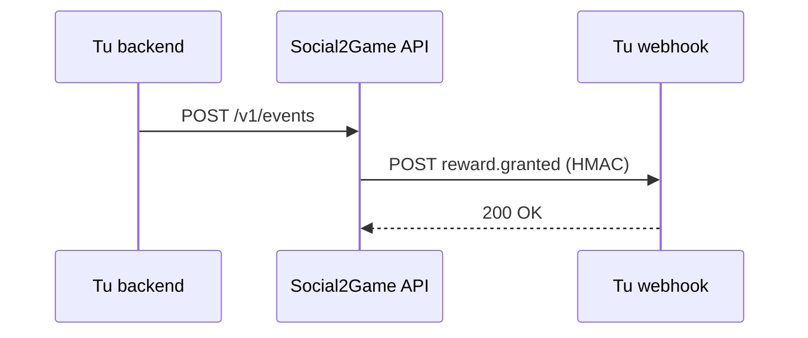

# Quickstart

1. [Creá una cuenta](https://app.social2game.com/signup) y generá una API key de test en el BO.
2. Enviá tu primer evento:

```bash
curl -X POST 'https://api.social2game.com/v1/events' \
  -H 'Authorization: Bearer wgpk_test_YOUR_KEY' \
  -H 'Content-Type: application/json' \
  -d '{"event_type":"login","player_id":"pl_demo_001"}'
```

3. Configurá tu callback de bonos en Webhooks del BO.
4. (Opcional) Sincronizá jugadores con `POST /v1/players/sync`.


